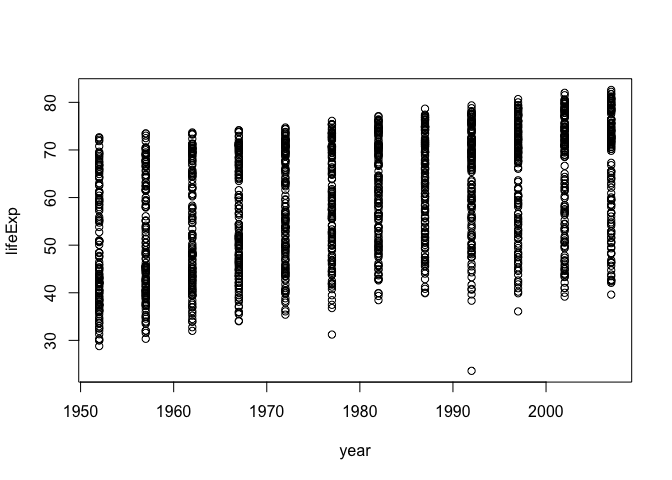
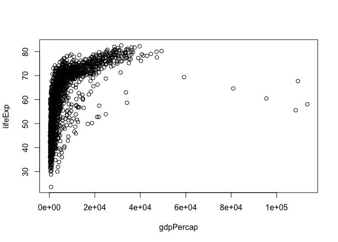
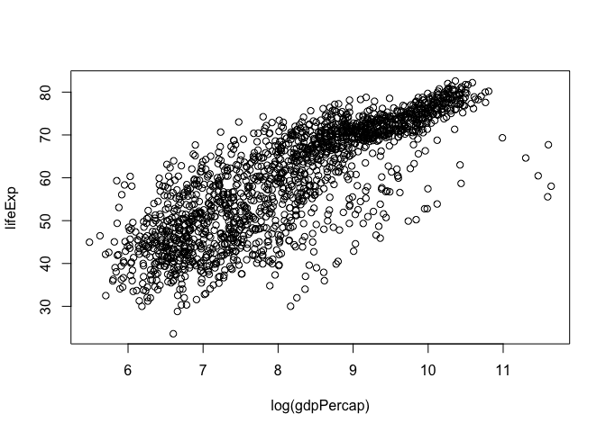
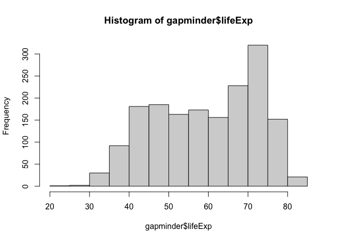
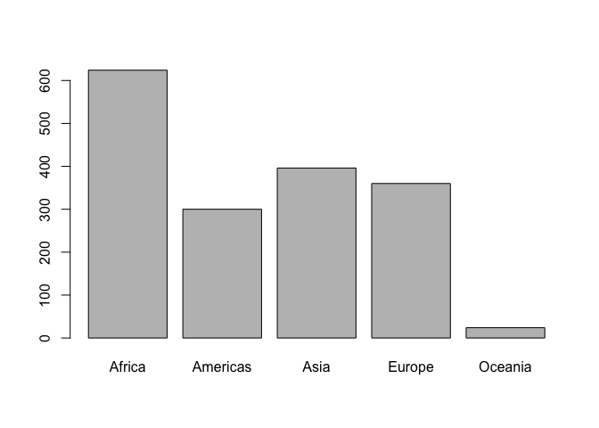

Lab 1: Getting started with R
================
Will Hall
29/12/2020

-   [Let’s get started!](#lets-get-started)
-   [Get the Gapminder data](#get-the-gapminder-data)
-   [Data frames are awesome](#data-frames-are-awesome)
-   [Meet the `gapminder` data frame or
    “tibble”](#meet-the-gapminder-data-frame-or-tibble)
-   [Look at the variables inside a data
    frame](#look-at-the-variables-inside-a-data-frame)
-   [Good practices](#good-practices)
    -   [Comment your code!](#comment-your-code)
    -   [Restarting R!](#restarting-r)
    -   [Use shortcuts!](#use-shortcuts)
-   [But I want to do more!](#but-i-want-to-do-more)
-   [Summary](#summary)

## Let’s get started!

Launch RStudio/R.

Notice the default panes:

-   Console (entire left)
-   Environment/History (tabbed in upper right)
-   Files/Plots/Packages/Help (tabbed in lower right)

FYI: you can change the default location of the panes, among many other
things: [Customizing
RStudio](https://support.rstudio.com/hc/en-us/articles/200549016-Customizing-RStudio).

### Loving Projects

Keeping all the files associated with a project organized together –
input data, R scripts, analytical results, figures – is such a wise and
common practice that RStudio has built-in support for this via its
[projects](https://support.rstudio.com/hc/en-us/articles/200526207-Using-Projects).

Let’s make one to use for the rest of this class. Note if you’ve already
made a project for this class, you don’t need to make another one. To
make a project: *File &gt; New Project…*. The directory name you choose
here will be the project name. Call it whatever you want.

This workflow will serve you well in the future:

-   Create an RStudio project for an analytical project
-   Keep inputs there (we’ll soon talk about importing)
-   Keep scripts there; edit them, run them in bits or as a whole from
    there
-   Keep outputs there (like the PDFs and figures)

Avoid using the mouse for pieces of your analytical workflow, such as
loading a dataset or saving a figure. Terribly important for
reproducibility and for making it possible to retrospectively determine
how a numerical table or PDF was actually produced (searching on local
disk on filename, among `.R` files, will lead to the relevant script).

### Writing a script

Next, open a new R script and develop and run your code from there. In
RStudio, use *File &gt; New File &gt; R Script*. Save this script with a
name ending in `.r` or `.R`, containing no spaces or other funny stuff,
and that evokes whatever it is we’re doing today. **Example:**
`lab-01-getting-started.r`.

## Get the Gapminder data

We will work with some of the data from the [Gapminder
project](https://www.gapminder.org/). If you haven’t already done so, go
ahead and install it from CRAN like so:

``` r
install.packages("gapminder")
```

Now load the package:

``` r
library(gapminder)
```

## Data frames are awesome

Whenever you have rectangular, spreadsheet-y data, your default data
receptacle in R is a data frame. Do not depart from this without good
reason. Data frames are awesome because…

-   Data frames package related variables neatly together,
    -   keeping them in sync vis-a-vis row order
    -   applying any filtering of observations uniformly
-   Most functions for inference, modelling, and graphing are happy to
    be passed a data frame via a `data =` argument. This has been true
    in base R for a long time.
-   The set of packages known as the
    [tidyverse](https://www.tidyverse.org/) takes this one step further
    and explicitly prioritizes the processing of data frames. This
    includes popular packages like dplyr and ggplot2. In fact the
    tidyverse prioritizes a special flavor of data frame, called a
    “tibble”.

Data frames – unlike general arrays or, specifically, matrices in R –
can hold variables of different flavors, such as character data (e.g.,
subject ID or name), quantitative data (e.g., reaction times), and
categorical information (e.g., experimental vs. control).

## Meet the `gapminder` data frame or “tibble”

By loading the gapminder package, we now have access to a data frame by
the same name. Get an overview of this with `str()`, which displays the
structure of an object.

``` r
str(gapminder)
```

    ## tibble [1,704 × 6] (S3: tbl_df/tbl/data.frame)
    ##  $ country  : Factor w/ 142 levels "Afghanistan",..: 1 1 1 1 1 1 1 1 1 1 ...
    ##  $ continent: Factor w/ 5 levels "Africa","Americas",..: 3 3 3 3 3 3 3 3 3 3 ...
    ##  $ year     : int [1:1704] 1952 1957 1962 1967 1972 1977 1982 1987 1992 1997 ...
    ##  $ lifeExp  : num [1:1704] 28.8 30.3 32 34 36.1 ...
    ##  $ pop      : int [1:1704] 8425333 9240934 10267083 11537966 13079460 14880372 12881816 13867957 16317921 22227415 ...
    ##  $ gdpPercap: num [1:1704] 779 821 853 836 740 ...

`str()` will provide a sensible description of almost anything and,
worst case, nothing bad can actually happen. When in doubt, just `str()`
some of the recently created objects to get some ideas about what to do
next.

We could print the `gapminder` object itself to screen. However, if
you’ve used R before, you might be reluctant to do this, because large
datasets just fill up your Console and provide very little insight.

This is the first big win for **tibbles**. The
[tidyverse](https://www.tidyverse.org/) offers a special case of R’s
default data frame: the “tibble”, which is a nod to the actual class of
these objects, `tbl_df`.

If you have not already done so, load the tidyverse package now:

``` r
library(tidyverse)
```

    ## ── Attaching packages ──────────────────────────────────────────────────────────────── tidyverse 1.3.0 ──

    ## ✓ ggplot2 3.3.2     ✓ purrr   0.3.4
    ## ✓ tibble  3.0.4     ✓ dplyr   1.0.2
    ## ✓ tidyr   1.1.2     ✓ stringr 1.4.0
    ## ✓ readr   1.4.0     ✓ forcats 0.5.0

    ## ── Conflicts ─────────────────────────────────────────────────────────────────── tidyverse_conflicts() ──
    ## x dplyr::filter() masks stats::filter()
    ## x dplyr::lag()    masks stats::lag()

Now we can boldly print `gapminder` to screen! It is a tibble (and also
a regular data frame) and the tidyverse provides a nice print method
that shows the most important stuff and doesn’t fill up your Console.

``` r
## see? it's still a regular data frame, but also a tibble
class(gapminder)
```

    ## [1] "tbl_df"     "tbl"        "data.frame"

``` r
gapminder
```

    ## # A tibble: 1,704 x 6
    ##    country     continent  year lifeExp      pop gdpPercap
    ##    <fct>       <fct>     <int>   <dbl>    <int>     <dbl>
    ##  1 Afghanistan Asia       1952    28.8  8425333      779.
    ##  2 Afghanistan Asia       1957    30.3  9240934      821.
    ##  3 Afghanistan Asia       1962    32.0 10267083      853.
    ##  4 Afghanistan Asia       1967    34.0 11537966      836.
    ##  5 Afghanistan Asia       1972    36.1 13079460      740.
    ##  6 Afghanistan Asia       1977    38.4 14880372      786.
    ##  7 Afghanistan Asia       1982    39.9 12881816      978.
    ##  8 Afghanistan Asia       1987    40.8 13867957      852.
    ##  9 Afghanistan Asia       1992    41.7 16317921      649.
    ## 10 Afghanistan Asia       1997    41.8 22227415      635.
    ## # … with 1,694 more rows

If you are dealing with plain vanilla data frames, you can rein in data
frame printing explicitly with `head()` and `tail()`.

``` r
head(gapminder)
```

    ## # A tibble: 6 x 6
    ##   country     continent  year lifeExp      pop gdpPercap
    ##   <fct>       <fct>     <int>   <dbl>    <int>     <dbl>
    ## 1 Afghanistan Asia       1952    28.8  8425333      779.
    ## 2 Afghanistan Asia       1957    30.3  9240934      821.
    ## 3 Afghanistan Asia       1962    32.0 10267083      853.
    ## 4 Afghanistan Asia       1967    34.0 11537966      836.
    ## 5 Afghanistan Asia       1972    36.1 13079460      740.
    ## 6 Afghanistan Asia       1977    38.4 14880372      786.

``` r
tail(gapminder)
```

    ## # A tibble: 6 x 6
    ##   country  continent  year lifeExp      pop gdpPercap
    ##   <fct>    <fct>     <int>   <dbl>    <int>     <dbl>
    ## 1 Zimbabwe Africa     1982    60.4  7636524      789.
    ## 2 Zimbabwe Africa     1987    62.4  9216418      706.
    ## 3 Zimbabwe Africa     1992    60.4 10704340      693.
    ## 4 Zimbabwe Africa     1997    46.8 11404948      792.
    ## 5 Zimbabwe Africa     2002    40.0 11926563      672.
    ## 6 Zimbabwe Africa     2007    43.5 12311143      470.

More ways to query basic info on a data frame:

``` r
names(gapminder)
```

    ## [1] "country"   "continent" "year"      "lifeExp"   "pop"       "gdpPercap"

``` r
ncol(gapminder)
```

    ## [1] 6

``` r
length(gapminder)
```

    ## [1] 6

``` r
dim(gapminder)
```

    ## [1] 1704    6

``` r
nrow(gapminder)
```

    ## [1] 1704

A statistical overview can be obtained with `summary()`:

``` r
summary(gapminder)
```

    ##         country        continent        year         lifeExp     
    ##  Afghanistan:  12   Africa  :624   Min.   :1952   Min.   :23.60  
    ##  Albania    :  12   Americas:300   1st Qu.:1966   1st Qu.:48.20  
    ##  Algeria    :  12   Asia    :396   Median :1980   Median :60.71  
    ##  Angola     :  12   Europe  :360   Mean   :1980   Mean   :59.47  
    ##  Argentina  :  12   Oceania : 24   3rd Qu.:1993   3rd Qu.:70.85  
    ##  Australia  :  12                  Max.   :2007   Max.   :82.60  
    ##  (Other)    :1632                                                
    ##       pop              gdpPercap       
    ##  Min.   :6.001e+04   Min.   :   241.2  
    ##  1st Qu.:2.794e+06   1st Qu.:  1202.1  
    ##  Median :7.024e+06   Median :  3531.8  
    ##  Mean   :2.960e+07   Mean   :  7215.3  
    ##  3rd Qu.:1.959e+07   3rd Qu.:  9325.5  
    ##  Max.   :1.319e+09   Max.   :113523.1  
    ## 

Although we haven’t begun our formal coverage of visualization yet, it’s
so important for getting to know a dataset that we will make a few
figures anyway. Here we use only base R graphics, which are very basic.

``` r
plot(lifeExp ~ year, gapminder)
```

<!-- -->

``` r
plot(lifeExp ~ gdpPercap, gapminder)
```

<!-- -->

``` r
plot(lifeExp ~ log(gdpPercap), gapminder)
```

<!-- -->

## Look at the variables inside a data frame

To specify a single variable from a data frame, use the dollar sign `$`.
Let’s explore the numeric variable for life expectancy.

``` r
head(gapminder$lifeExp)
```

    ## [1] 28.801 30.332 31.997 34.020 36.088 38.438

``` r
summary(gapminder$lifeExp)
```

    ##    Min. 1st Qu.  Median    Mean 3rd Qu.    Max. 
    ##   23.60   48.20   60.71   59.47   70.85   82.60

``` r
hist(gapminder$lifeExp)
```

<!-- -->

The year variable is an integer variable, but since there are so few
unique values it also functions a bit like a categorical variable.

``` r
summary(gapminder$year)
```

    ##    Min. 1st Qu.  Median    Mean 3rd Qu.    Max. 
    ##    1952    1966    1980    1980    1993    2007

``` r
table(gapminder$year)
```

    ## 
    ## 1952 1957 1962 1967 1972 1977 1982 1987 1992 1997 2002 2007 
    ##  142  142  142  142  142  142  142  142  142  142  142  142

The variables for country and continent hold truly categorical
information, which is stored as a *factor* in R.

``` r
class(gapminder$continent)
```

    ## [1] "factor"

``` r
summary(gapminder$continent)
```

    ##   Africa Americas     Asia   Europe  Oceania 
    ##      624      300      396      360       24

``` r
levels(gapminder$continent)
```

    ## [1] "Africa"   "Americas" "Asia"     "Europe"   "Oceania"

``` r
nlevels(gapminder$continent)
```

    ## [1] 5

The **levels** of the factor `continent` are “Africa”, “Americas”, etc.
and this is what’s usually presented to your eyeballs by R. In general,
the levels are friendly human-readable character strings, like
“control/experimental”. But *never ever ever* forget that, under the
hood, R is really storing integer codes 1, 2, 3, etc. Look at the result
from `str(gapminder$continent)` if you are skeptical.

``` r
str(gapminder$continent)
```

    ##  Factor w/ 5 levels "Africa","Americas",..: 3 3 3 3 3 3 3 3 3 3 ...

Factors can be rich with booby traps for the unsuspecting but they are a
necessary evil. We will learn how to work with them later in the course
– in fact we’ll spend a whole lecture on factors. The pros far outweigh
the cons. Specifically in modelling and figure-making, factors are
anticipated and accommodated by the functions and packages you will want
to use.

Here we count how many observations are associated with each continent
and, as usual, try to portray that info visually. This makes it much
easier to quickly see that African countries are well represented in
this dataset.

``` r
table(gapminder$continent)
```

    ## 
    ##   Africa Americas     Asia   Europe  Oceania 
    ##      624      300      396      360       24

``` r
barplot(table(gapminder$continent))
```

<!-- -->

You can also refer to variables in data frame by column number. Don’t do
this. It makes for code that is difficult to read. . Also, if the
variable changes location in your data frame you’ll end up referring to
the wrong variable.

If you want to specify a variable by column number, you use double
square brackets `[[]]`. The code below prints the first 10 entries of
the fourth variable (lifeExp) in the gapminder data frame.

``` r
head(gapminder[[4]])
```

    ## [1] 28.801 30.332 31.997 34.020 36.088 38.438

# Good practices

## Comment your code!

Comments start with one or more `#` symbols. Use them. RStudio helps you
(de)comment selected lines with Ctrl+Shift+C (Windows and Linux) or
Command+Shift+C (Mac).

``` r
#remember to comment your code!
```

## Restarting R!

Now practice restarting R. In RStudio, use *Session &gt; Restart R*.

Why do we do this? So that the code you write is complete and
re-runnable. If you return to a clean slate often, you will root out
hidden dependencies where one snippet of code only works because it
relies on objects created by code saved elsewhere or, much worse, never
saved at all. Similarly, an aggressive clean slate approach will expose
any usage of packages that have not been explicitly loaded.

Restart R and re-run your code.

## Use shortcuts!

I introduced you to a number of keyboard shortcuts for sending code to
the console. Practice using them!

Send this code to the console using a shortcut.

``` r
x <- 3 * 4
x
```

    ## [1] 12

R Studio offers many handy [keyboard
shortcuts](https://support.rstudio.com/hc/en-us/articles/200711853-Keyboard-Shortcuts).
Also, Alt+Shift+K brings up a keyboard shortcut reference card. Take a
look at these and see what shortcuts you might want to introduce into
your workflow.

Test out tab-completion. Make the assignment below.

``` r
this_is_a_really_long_name <- 2.5
```

Then type the first few characters, press TAB, add characters until you
disambiguate, then press return.

# But I want to do more!

Check out [swirl](http://swirlstats.com). Swirl turns the R console into
an interactive learning environment.

Swirl is a little like a text-based RPG, except it’s more fun because it
teaches you R!

<div class="figure">


<p class="caption">
Note: This is not Swirl, but yes, you can mix gifs and R code! Tune in
next week to find out more.
</p>

</div>

Work through one or more interactive tutorials that are part of the
swirl package.

You’ll need to install the Swirl package, but you know how do that!

``` r
#in case you forgot how to install a package
install.packages("swirl")

#load swirl
library(swirl)

#start working through the interactive tutorials
swirl()
```

# Summary

-   Use Rstudio Projects!!!

-   Use data frames!!!

-   Use the [tidyverse](https://www.tidyverse.org/)!!! This will provide
    a special type of data frame called a “tibble” that has nice default
    printing behavior, among other benefits.

-   When in doubt, `str()` something or print something.

-   Always understand the basic extent of your data frames: number of
    rows and columns.

-   Understand what flavor the variables are.

-   Learn how to use factors!!! I wouldn’t give too much thought to
    factors at this stage of the course, but later we’ll take a deep
    dive into working with factors.

-   Do basic statistical and visual sanity checking of each variable.

-   Refer to variables by name, e.g., `gapminder$lifeExp`, not by column
    number. Your code will be more robust and readable.
